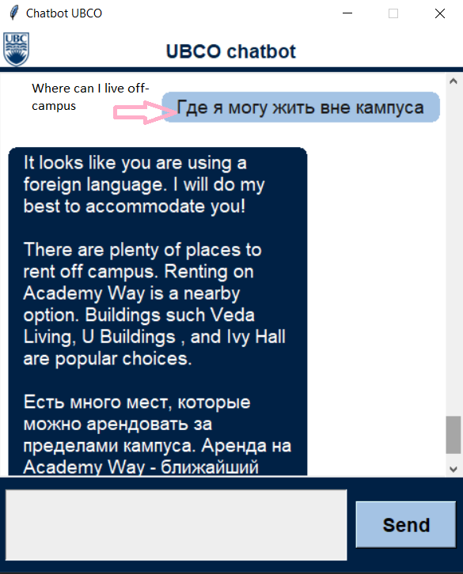
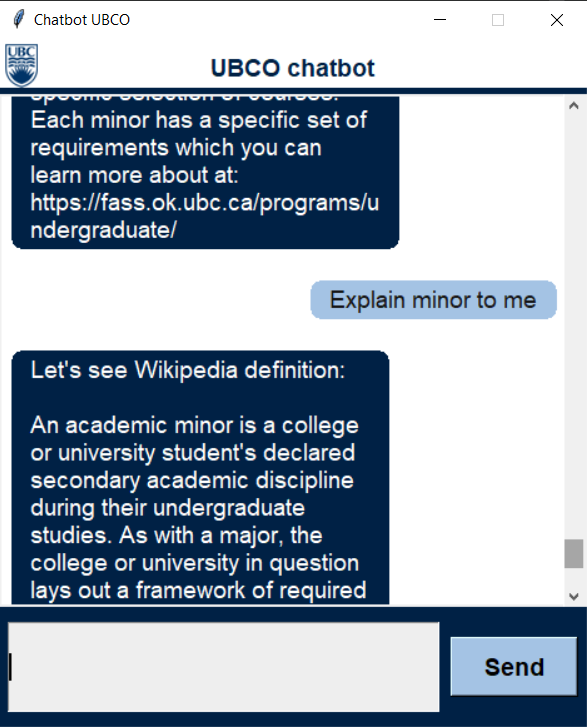
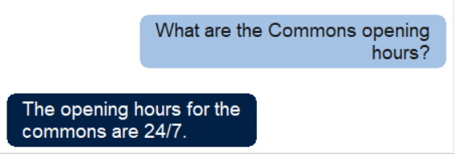
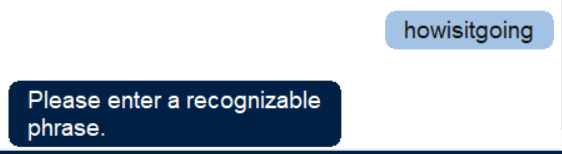
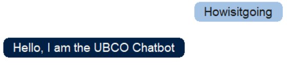
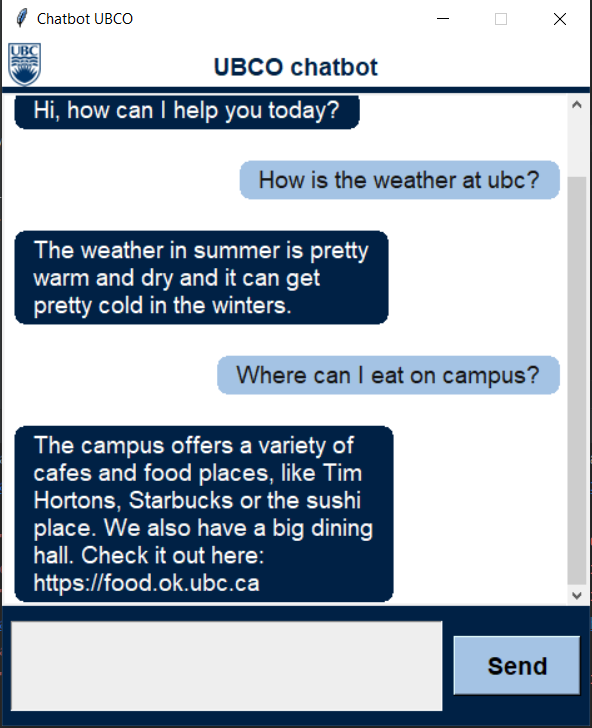
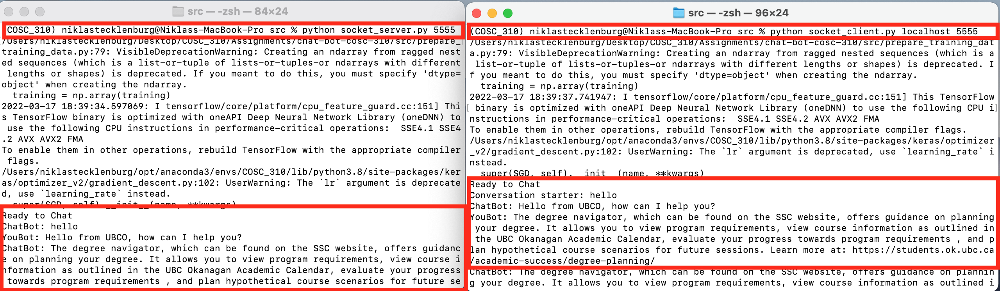
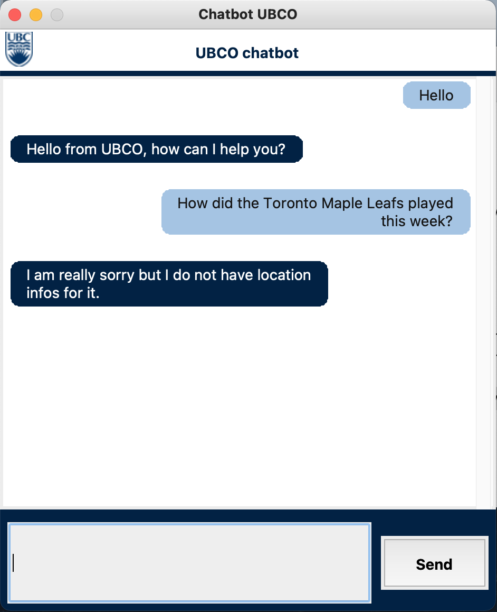

# chat-bot-cosc-310
The purpose of this chatbot is to help students and interested people to navigate around and get information about UBCO, like opening hours locations but also infor on the application process. By this the enables the user to easily get access to the information about UBCO he/she is looking for.

## Installation
1. Ensure you have the latest version of [Python](https://www.python.org/downloads/) installed.

2. Install `pipenv` ([Pipenv Documentation](https://pypi.org/project/pipenv/))
    1. Open the command terminal
    2. Run `pip install pipenv`

3. Download the project dependencies
    1. Open the command terminal in the project root directory
    2. Run `pipenv shell` to start the virtual environment
    3. Run `pipenv update` or `pipenv update --dev` (developers) to download the project's dependencies
    4. Run `pipenv run python -m spacy download en_core_web_sm` to download spacy's dependencies
    
## Running Unit Tests

- To run all tests run `python -m unittest discover -s ./`

- To run a specific test file:
    - Run the test file directly `python <test_file>.py`
    - Or run `python -m unittest <test_file>.<TestClass>`

- To run a specific test
    - Run `python -m unittest <test_file>.<TestClass>.<test_name>`

### Important Note: 
Run all tests from the `tests` directory. 
This ensures the mock files are located correctly by Python.

## Running the Application
Run `python chatbot_run.py` to start the application.

## The list of features
### *Newly added features (individual project)*:
### Translation using googletrans (Google translate API)
The file `translator.py` translates the user's text to english, identifies the language the user used and translates bot's response into user's language. This class is used in `chatbot.py` to translate user's message, generate bot's response to translated message and then if user's language is not english translate bot's response to user's language. If user's language is not English the bot's final response consists of the translated and untranslated version of the response.
 
   **Snippet:**
    
   

### Providing definitions from Wikipedia (Wikipedia API)
The file `wiki.py` identifies the word a user wants a definition for, finds the according article on Wikipedia and returns the summary of the Wikipedia article. This class is used in `chatbot.py` then user's intent is identified as "definition" the program will find out which word the user wants defined and provide a 3 sentence definition from Wikipedia.

   **Snippet:**
    
   

### Named Entity recognition using Spacy
The file `NER_func.py` analyzes the raw user text and identifies named entities in it (For example UBCO and Commons are named entities). We then use this function in `chatbot.py`. If there were named entities in the message the bot will provide the information user requested for a given entity. For example, the bot can provide the information on the opening hours of the Commons.

   **Snippet:**
    
   

### Spellchecker using symspellpy
The file `spellchecker.py` provides the class which splits the conjoined words and corrects minor spelling mistakes. The file accepts raw text and returns the corrected version. Later, this corrected message is used to get the response from the bot. The bot gives more meaningful responses to the sentences which went through spell checking (as opposed to misspelled sentences which did not go through it), because it helps standardize the type of requests the bout usually receives.

   **Snippet with spellchecking disabled:**
    
   

   **Snippet with spellchecking enabled:**

   

### Graphical user interface using tkinter in Python
The file `app_gui.py` creates a graphical interface for the chatbot which opens in a separate window. The graphical interface improves user experience by providing an intuitive way of talking to a bot.

   **Snippet:**

   

### Sockets using Python sockets
Sockets allow the bot to interact with other bots (or itself). The files `socket_client.py` and `socket_server.py` contain the implementation of TCP sockets, using the socket module in Python. These allow our bot to play either the server or the client role when interacting with other bots, that are able to send and receive messages using TCP connections.

   **Snippet:**

   
    
### Share with user if not sure about the input
The chatbot uses a threshold on the intents prediction and under a certain threshold returns, that he did no understand the user probably.

   **Snippet:**

   
    

